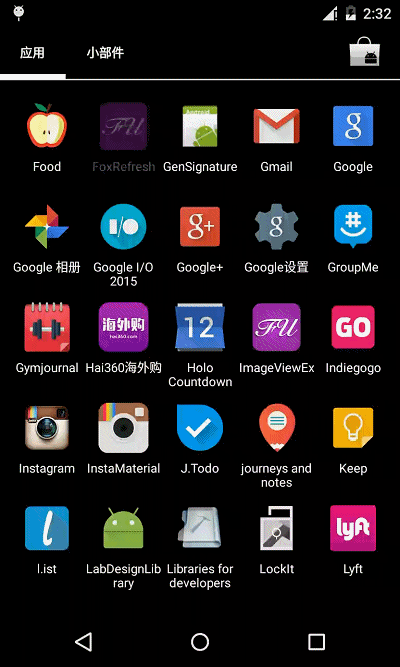

FoxRefresh
=====================

## 描述

下拉刷新，如图，好吧，又一个下拉刷新，`PullRefreshBaseView`继承自`FrameLayout`里面放了`AbsListView`，上层`PullRefreshProgressListView`继承自`RelativeLayout`里面放了 [PullRefreshBaseView](https://github.com/MrFuFuFu/MrFuPullToRefresh) 和 [SmoothProgressBar](https://github.com/castorflex/SmoothProgressBar)，这么做的目的是为了是让`SmoothProgressBar` 能在最顶部显示出来。 上拉加载中使用的 [CircularProgress](https://github.com/castorflex/SmoothProgressBar) 同样使用的是 [castorflex](https://github.com/castorflex) 的 [SmoothProgressBar](https://github.com/castorflex/SmoothProgressBar) 的开源项目，oh，开源真是太方便了。I love open source code.

## 截图

## More about me

* [MrFu-傅圆的个人博客](http://mrfufufu.github.io/)

License
============

    Copyright 2015 MrFu

	Licensed under the Apache License, Version 2.0 (the "License");
	you may not use this file except in compliance with the License.
	You may obtain a copy of the License at

     http://www.apache.org/licenses/LICENSE-2.0

	Unless required by applicable law or agreed to in writing, software
	distributed under the License is distributed on an "AS IS" BASIS,
	WITHOUT WARRANTIES OR CONDITIONS OF ANY KIND, either express or implied.
	See the License for the specific language governing permissions and
	limitations under the License.